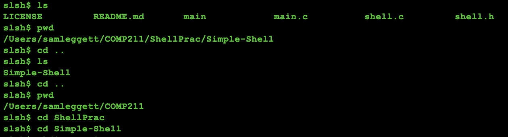
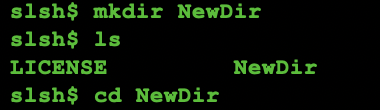
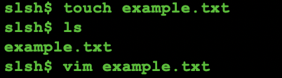
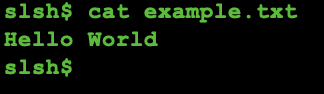
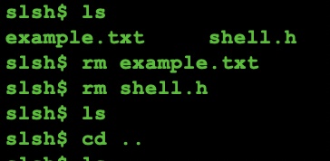
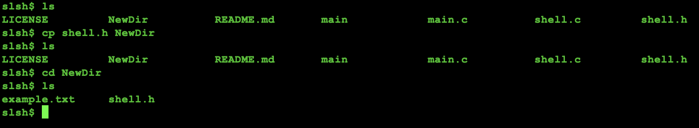

# Simple-Shell

A simple computer shell.

## Functionality 

As shown in the photos below, this simple slsh (sam leggett shell) executes basic commands when running in a terminal, similar to those you would use to navigate the terminal normally. Most all commands are supported, though there are still issues with the auto-complete tab function that is provided by most shells. This project helped me understand the process lifecycle and how the most basic programs are managed by a CPU at the system level. 

### cd, ls, pwd

### mkdir

### touch

### cat

### rm 

### cp

## Moving Forward

I intend to make the shell more personalized in the future -- I'll maybe even include some ASCII graphics. I eventually also want to attempt making a shell that can simulate my SAP code by loading the contents of a .txt or .csv file into the RAM module and displaying the status of each register/bus throughout the run process.
